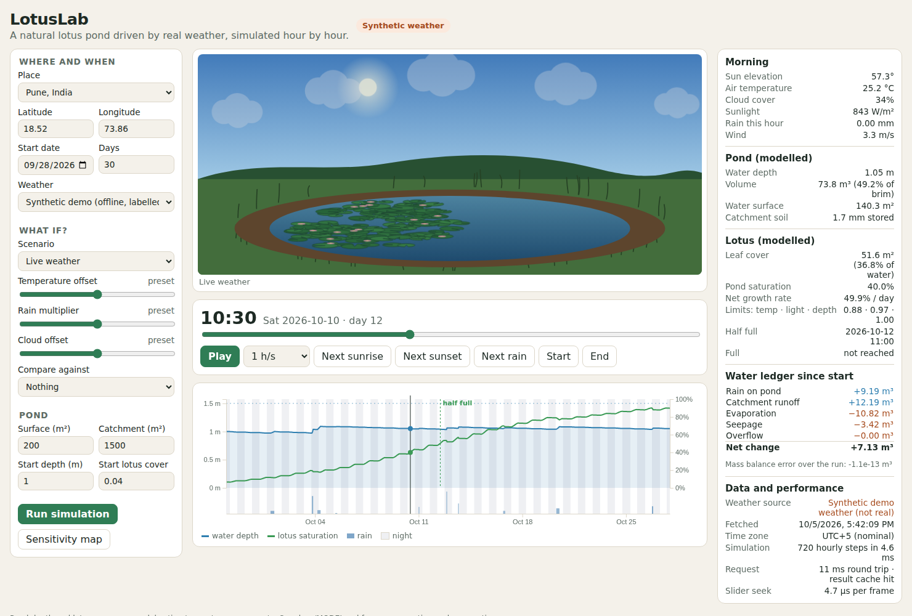
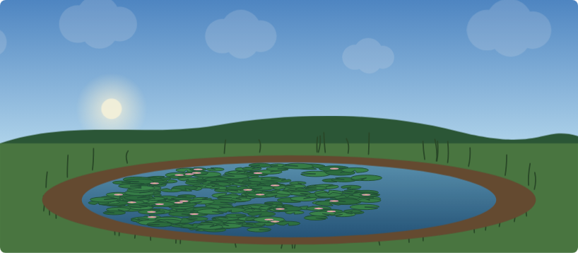
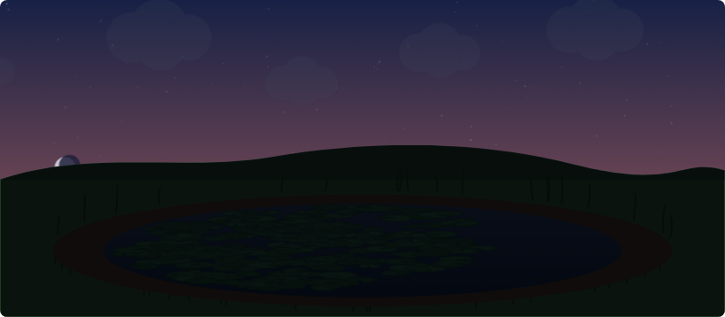
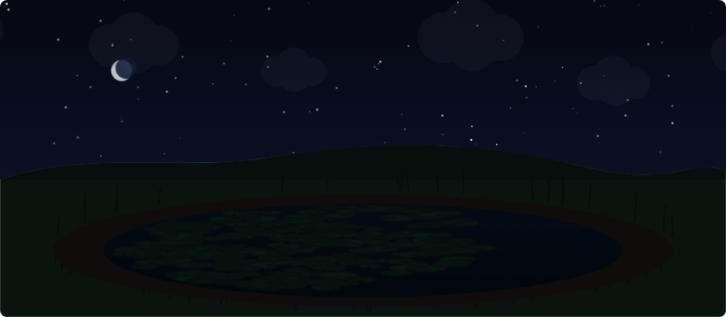

# LotusLab

**A natural lotus pond driven by real weather, simulated hour by hour, and scrubbed in
constant time.**

Pick a place and a date range. The backend pulls hourly weather from the free
[Open-Meteo](https://open-meteo.com/) API, integrates a coupled sun / water / lotus model
over every hour, and sends the browser one compact precomputed timeline. A time slider
then moves through that timeline minute by minute: the sky, sun, moon, clouds, rain, water
level and lotus pads all follow the selected instant with no further network calls.

No database. The engineering is in the algorithms: how fast and how correctly weather
becomes a living pond.



| Morning | Dusk | Night |
|---|---|---|
|  |  |  |

## What it does

* **Real weather in.** Temperature, rain, cloud, wind, humidity, solar radiation and FAO-56
  reference evapotranspiration, hourly, from Open-Meteo's forecast API (recent and next
  15 days) or archive API (historical). Gaps are interpolated and reported.
* **A natural pond.** Bowl-shaped basin, rain on the pond, runoff from a catchment whose
  soil has to wet up first, open-water evaporation, seepage and overflow at the spill
  level. Every flux is booked in a ledger; the mass balance closes to ~1e-13 m³.
* **Lotus that respond to it.** Logistic growth limited by temperature, sunlight and
  water depth, with the carrying capacity equal to the *current* water surface, so a
  falling pond squeezes the lotus.
* **The Day 29 puzzle, in real life.** The chart marks when the pond is half full and
  when it is full, so you can see how short the last doubling is.
* **What-if laboratory.** Monsoon surge, heatwave, overcast and drought presets or custom
  offsets, live vs what-if ponds side by side with divergence metrics, and a sensitivity
  heatmap of temperature × rain.
* **Honest about data.** Every response carries provenance: source, fetch time, cache
  status, gaps filled. If the provider is down, a recent cached copy is served and marked
  stale; otherwise you get a 503 and an explicit, labelled synthetic-weather option.

## How the water works

The pond is not a fixed blue shape. Its water is simulated every hour from the weather,
and everything you see (the water edge, the mud ring, overflow, how much room the lotus
has) comes from that water budget.

### Every hour, in this order

1. **Rain falls on the pond.** Rain (mm) × the pond's full footprint goes straight in.
2. **Rain falls on the land around it.** The catchment soil acts like a sponge. After a
   dry spell it soaks up most of the rain; once it is wet, most of the rain runs off
   into the pond. If the sponge is full, everything runs off. Between showers the soil
   slowly dries out again.
3. **Water evaporates.** Open-Meteo's reference evaporation (FAO-56 ET₀, which already
   accounts for heat, sun, wind and humidity) × 1.05 for open water × the *current*
   water surface. Hot, sunny, windy, dry hours lose the most.
4. **Water seeps away** through the pond bed, in proportion to the wetted area.
5. **Overflow.** If the pond goes above its spill level, the extra water leaves over the
   edge and is counted as overflow.
6. **The new depth and surface** come from the volume. The pond is bowl shaped
   (deep in the middle, shallow at the edges), so as it dries the water surface shrinks,
   which also slows further evaporation. Lotus that end up on dry mud die back.

Losses can never take more water than the pond holds, and every litre is booked in a
ledger (rain, runoff, evaporation, seepage, overflow). Start volume + inflows − outflows
equals end volume to about 1e-13 m³, and every API response reports that error.

### What it looks like in numbers

Default pond: 200 m² at the brim, 1.5 m spill depth, starting at 1.0 m, with 1,500 m² of
land draining into it.

| Situation | What the model does |
|---|---|
| 30 mm storm over 3 hours | Water rises from 1.00 m to 1.14 m. Only 6 m³ fell on the pond itself; 13 m³ came as runoff from the land. |
| 20 mm of rain on dry vs. soaked land | Dry soil sends 1 mm of it to the pond; soaked soil sends all 20 mm. |
| Hot dry week (6 mm/day evaporation, no rain) | Water drops from 1.00 m to 0.94 m (5.7 m³ evaporated, 1.8 m³ seeped). The water surface shrinks from 133 m² to 126 m². |
| Monsoon burst on a nearly full pond | Depth caps at the 1.5 m spill level; 139 m³ overflows over 8 hours. |

You can reproduce these with the functions in `backend/lotuslab/core`, and the test suite
checks the same behaviour (mass balance over a year, overflow never exceeding the brim,
a dry pond never going negative, wetter soil producing more runoff).

### How the water drives everything else

* **Lotus capacity** is the current water surface, so a shrinking pond squeezes the lotus
  and a stranded shoreline kills leaves.
* **Lotus growth** slows in water that is too shallow and stops on exposed mud.
* **The scene** draws the water edge from the modelled surface area, shows the dry mud
  ring as the pond drops, adds rain and ripples from the hourly rainfall, and shows water
  spilling over the edge during overflow hours.
* **The chart** plots depth against the dashed spill line, with rain bars underneath, and
  the Inspector shows the running water ledger at the selected minute.
* **What-if scenarios** change rain, temperature, cloud and wind, and the water budget
  follows: hotter or windier raises evaporation, more cloud lowers it, more rain raises
  both direct rain and runoff.

## The algorithms

| Problem | Approach | Cost |
|---|---|---|
| Sun position for every hour | NOAA solar algorithm, vectorised with numpy | one pass |
| Pond state over time | One sequential pass; closed-form paraboloid volume ⇄ depth ⇄ area | O(hours) |
| Lotus growth | Exact logistic step (stable for any time step) | O(1) per hour |
| Slider seek | Regular grid: index = (t − t₀) / Δt, then linear interpolation | **O(1)** |
| Rain / evaporation between any two instants | Prefix sums of every flux | **O(1)** |
| Next sunrise / sunset | Precomputed crossings + binary search | O(log n) |
| Drawing lotus cover | Fixed seeded leaf layout ordered by spread; show first k, k by binary search over cumulative leaf area | O(log n), no re-layout |
| Playback | Simulation time is a function of wall-clock time, not frame count | frame-rate independent |
| Repeat requests | Weather cache (TTL, LRU, single-flight, stale-if-error) + result cache of pre-gzipped JSON | ~1 ms on a hit |

Full equations and assumptions: [docs/MODEL.md](docs/MODEL.md). The build plan and phases:
[PLAN.md](PLAN.md).

### Benchmarks

`cd backend && python -m benchmarks.bench` (median of repeated runs, Python 3.11, one core):

| Operation | Median |
|---|---|
| simulate 30 days (720 hourly steps) | 2.2 ms |
| simulate 90 days (2,160 steps) | 6.7 ms |
| simulate 365 days (8,760 steps) | 37 ms |
| `seek(t)` on a 365-day timeline, all 32 columns | 7 µs |
| rain total between two instants (prefix sums) | 4 µs |
| all 5 scenario presets, 30 days | 19 ms |
| serialise a 30-day timeline to JSON + gzip | 15 ms |
| 30-day payload size (gzip) | 53 KiB |

In the browser a full-state seek measures about 5 µs, roughly 3,000 times inside a 16 ms
frame budget. The Inspector panel shows the number measured on your machine.

## Architecture

```
            Open-Meteo (forecast / archive)
                          │  httpx, timeouts, retries
┌─────────────────────────▼──────────────────────────┐
│ FastAPI  backend/lotuslab                          │
│  api/        schemas (Pydantic, strict) + routes   │
│  services/   Open-Meteo adapter, TTL/LRU caches,   │
│              simulation service                    │
│  core/       pure model: solar, weather, hydrology,│
│              lotus, engine, scenarios, classic     │
└─────────────────────────┬──────────────────────────┘
                          │  one columnar timeline (JSON, gzip)
┌─────────────────────────▼──────────────────────────┐
│ React + TypeScript + D3  frontend/src              │
│  engine/     Timeline (O(1) seek), PlaybackClock,  │
│              sky colours, leaf layout              │
│  components/ PondScene (D3/SVG), TimeSlider,       │
│              TimelineChart, Inspector, Controls,   │
│              SensitivityMap                        │
└────────────────────────────────────────────────────┘
```

The backend is the only place the model runs. The browser only looks up and interpolates
backend rows, so the two can never disagree.

### API

| Method | Path | Purpose |
|---|---|---|
| GET | `/api/v1/health` | status and cache statistics |
| GET | `/api/v1/scenarios` | what-if presets |
| POST | `/api/v1/simulations` | run a simulation, returns timeline + summary + provenance |
| POST | `/api/v1/simulations/compare` | baseline vs variant on the same weather, with divergence |
| POST | `/api/v1/simulations/sensitivity` | grid of temperature offset × rain multiplier |
| GET | `/api/v1/puzzle` | the classic doubling puzzle |

Interactive docs at `http://127.0.0.1:8000/docs`.

```json
POST /api/v1/simulations
{
  "latitude": 18.52, "longitude": 73.86,
  "start_date": "2026-09-28", "days": 14,
  "source": "auto",
  "scenario": { "preset": "heatwave", "temperature_offset_c": 3 },
  "pond": { "surface_area_m2": 200, "initial_depth_m": 1.0 },
  "lotus": { "initial_cover_fraction": 0.04 }
}
```

## Run it

Backend (Python 3.11+):

```bash
cd backend
python -m venv .venv && source .venv/bin/activate
pip install -e ".[dev]"
uvicorn lotuslab.main:app --reload        # http://127.0.0.1:8000/docs
pytest                                     # 69 tests
python -m benchmarks.bench
```

Frontend (Node 20+), in a second terminal:

```bash
cd frontend
npm install
npm run dev                                # http://localhost:5173 (proxies /api to :8000)
npm test                                   # vitest
```

Or both with Docker: `docker compose up --build`, then open http://localhost:8080.

Settings are environment variables prefixed `LOTUSLAB_` (see
`backend/lotuslab/config.py`), for example `LOTUSLAB_FORECAST_TTL_S` or
`LOTUSLAB_CORS_ORIGINS`.

## Status

Phases 1 to 3 of [PLAN.md](PLAN.md) are in place, with most of 4 and 5 (playback, jumps,
comparison, sensitivity) and the Docker/CI pieces of 6. Next: calibration against a real
pond, forecast-vs-observed replay, and a Web Worker for multi-year timelines.

Pond depth and lotus cover are **model estimates**, not measurements.

Weather data by [Open-Meteo.com](https://open-meteo.com/) (CC BY 4.0).
